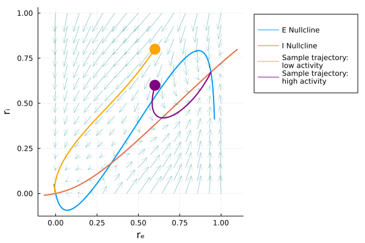

# Tutorial

Here I give an example of an analysis workflow showcasing some of the convenience functions
built into this package by looking at a Wilson-Cowan network model. 

## Initialize model
---

Begin by loading the pacakge along with Plots so we can visualize
our work.

    using NeuralDyanmics, Plots

We will then be able to instantiate our model. Custom models can be built but since the Wilson-Cowan model is built in we can simply call the default parameters and the model equations as follows:

    julia> params = initializeParams("WC")
    Dict{Symbol, Float64} with 12 entries:
        :tauE   => 1.0
        :wEE    => 9.0
        :wIE    => 13.0
        :thetaE => 2.8
        :wEI    => 4.0
        :wII    => 11.0
        :tauI   => 2.0
        :aE     => 1.2
        :aI     => 1.0
        :II     => 0.0
        :thetaI => 4.0
        :IE     => 0.0

    julia> mdl = modelEquations("WC")
    modelEquations("WC", (NeuralDynamics.wc_drₑ, NeuralDynamics.wc_drᵢ), (NeuralDynae, NeuralDynamics.wc_iNullcline))

## Find nullclines
---

Above I have shown the output to give you some idea of these structures that are used throughout the majority of this package. We may like to begin by exploring our model in the phase plane. The equations for the nullclines can be found in our modelEquations as we can see by typing the following:

    julia> mdl.nullclines
    (NeuralDynamics.wc_eNullcline, NeuralDynamics.wc_iNullcline)

Thus, we can define the space we would like to observe and call the function `getNullclines` and plot the output to visualize our nullclines in the phase plane.

    rₑNull = collect(-0.01:0.001:0.96)
	rᵢNull = collect(-0.01:0.001:0.8)
    ncls = getNullclines(rₑNull, rᵢNull, mdl, params)

    plot(rₑNull, ncls[1], xlab="rₑ", ylab="rᵢ", label="E Nullcline", linewidth=2, legend=:topleft)
	plot!(ncls[2], rᵢNull, label="I Nullcline", linewidth=2)

## Find fixed points
---

We see that our model has three fixed points so our next step may be to numerically estimate the locations of these fixed points. For this we can call the `findfixedpoints` function. This function will need to be supplied with some initial guesses which we can visually determine from the previous plot. We will also use the helper function fWC! here and visualize the fixed points on the previous plot.

    fps = findFixedPoints(guesses, fWC!, params)
    for coord in fps
		dispVal = round.(coord, digits=2)
		scatter!([coord[1]], [coord[2]], color=:black, markersize=8,
			legend=:none)
		annotate!([coord[1]], [coord[2]+0.1], text("$dispVal"))
	end

## Find fixed point stability numerically
---

Now that we have our fixed points we may be interested in which of these fixed points were stable. This can be tested numerically by checking the eigenvalues of the Jacobian matrix describing our system. If any of the real components for a given point are positive then that fixed point is unstable. For this we will use the `getJacobianEigenvalues` function and check the results.

    getJacobianEigenvalues(fps, params)
    3-element Vector{Any}:
    ComplexF64[-0.6233838572258439 - 0.1311095729053099im, -0.6233838572258439 + 0.1311095729053099im]
    [-0.8726689790568727, 1.057207976436168]
    [-1.4219741349895596, -0.95956219494619]

Checking this we see that our second fixpoint is unstable and the other two are stable. 

## Observe vector fields
---

Alternatively, or as a complementary approach we may wish to visualize the behavior of the system. One way we may do this is by plotting the vector fields on top of our original plot of the nullclines. First we call the function `getVectorFields` and we input these results into the convenience plotting function `plotVectorFields!`. Notice the `!` at the end of this function. This means that this function is ment to modify an existing plot and not generate a new plot on its own.

    eiArr = 0:0.05:1
    fields = getVectorFields(eiArr, wc2, params, subdivisions=15)

    plot(rₑNull, ncls[1], xlab="rₑ", ylab="rᵢ", label="E Nullcline", 							linewidth=2, legend=:outertopright)
	plot!(ncls[2], rᵢNull, label="I Nullcline", linewidth=2)
	plotVectorFields!(eiArr, fields, color =:teal, alpha=0.2)

Notice that we supplied an array that defines the space over which we want to generate our field lines. Further, we supplied the optional argument subdivisions that will define the granularity of the sampling of this space. The default value is 10 which would result in a 10x10 grid of field lines. Here, we generated a 15x15 grid. 

## Simulate data
---

It is still difficult to predict the behavior from visualizing the field lines alone. It may be advantageous to pick initial conditions in phase space and simulate the behavior of the system using the function `simulate`.

    ## Simulate with different initial conditions
	rₑ3, rᵢ3 = simulate(0:0.1:50, "WC", params, (0.6,0.8))
	rₑ4, rᵢ4 = simulate(0:0.1:50, "WC", params, (0.6,0.6))

We can then visualize these simulations by plotting them using the function `plotTrajectory!`. 

    plotTrajectory!(rₑ3, rᵢ3, color=:orange, label="Sample trajectory: \nlow activity", markersize=10, linewidth=2, markerstrokewidth=0)
	plotTrajectory!(rₑ4, rᵢ4, color=:purple, label="Sample trajectory: \nhigh activity", markersize=10, linewidth=2, markerstrokewidth=0)

Interestingly, and perhaps unsurprisingly based on our numerical results we see here that each simulation converges to one of the two stable fixed points we found earlier.

We may wish to sample more of the phase space in our simulations. I will remove the vector fields here for clarity but we can call the function `plotTrajectories!`. Unlike plotTrajectory the simulation is built into this function. We must simply define a set of coordinates from which to seed these simulations. Here I'll use the vector `sampleSpace` to define that granularity and will reset the plot to simply show these simulations on top of the nullclines for clarity.

    sampleSpace = 0.0:0.2:1

    plot(rₑNull, ncls[1], xlab="rₑ", ylab="rᵢ", label="E Nullcline", 							linewidth=2, legend=:outertopright)
	plot!(ncls[2], rᵢNull, label="I Nullcline", linewidth=2)
    plotTrajectories!(0:0.1:50, sampleSpace, sampleSpace, "WC", params, color=:gray, label="Sample Trajectories", alpha=0.5)

This further cements the idea that our central fixed point is likely unstable (at least at the granularity we have sampled). We can see that all our simulations converge on either of the two stable fixed points we found earlier.

## Simulations in time domain
---

While phase space can be informative we lose information about the behavior of our system in time. Here, I will show the same system under a different set of initial conditions in both phase space and in the time domain. 

    params = initializeParams("WC";wEE=6.4, wEI=4.8, wIE=6.0, wII=1.2, IE=0.8, tauI=2.0)

    ncls = getNullclines(rₑNull, rᵢNull, mdl, params)
	fields = getVectorFields(eiArr, mdl, params)

    l3 = @layout [a b]

    pWC3 = plot(rₑNull, ncls[1], xlab="rₑ", ylab="rᵢ", label="E Nullcline", 							linewidth=2, legend=:none)
	plot!(ncls[2], rᵢNull, label="I Nullcline", linewidth=2)
    plotVectorFields!(eiArr, fields, color =:teal, alpha=0.3)
    plotTrajectories!(0:0.1:100, sampleSpace2, sampleSpace2, "WC", params4, color=:gray, label="Sample Trajectories", alpha=0.5)

    pWC3Activity = plot(0:0.1:100, rₑ8, label="E population", color=:blue, ylim=(0,1))
	plot!(0:0.1:100, rᵢ8, label="I population", color=:red) 

	plot(pWC3, pWC3Activity, layout=l3)

Much of the code above is dedicated to styling the plots you can learn more about this by looking at the documentation for Plots.jl. As you can see however the workflow for analyzing the dynamical systems is relatively simple.

Under these initial conditions we see that our system appears to fall into a stable limit cycle and in the time domain we see tonic spiking activity!

## Remarks
---

I hope this tutorial was clear and please reach out if you have any questions or suggestions. 

If you would like some more examples there are a number of Pluto notebooks attached to the repository that allow for interactive exploration of this example and others.